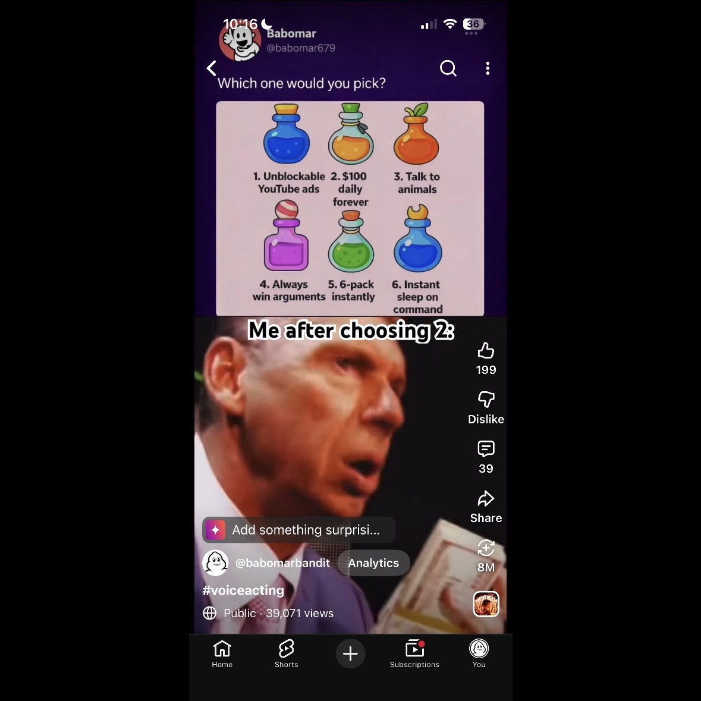

# Automatic YouTube Shorts Generator

## Overview
Automatically turns reddit posts into short form videos and uploads them to youtube. 
Reddit post → custom meme template → AI-selected clip → final video → optional YouTube upload.

## Features
- Scrapes top Reddit image posts
- Filters unusable images
- Builds a custom meme image
- Uses AI to choose a matching reaction clip
- Creates a vertical Shorts-style video
- Optionally uploads to YouTube

## Demo / Final Output
The program generates a vertical short-form video called `final_output.mp4`.



The final output includes the generated meme image on the top half, the selected reaction clip on the bottom half, an AI-generated caption, and audio from the selected clip

## How It Works
1. `webscraping.py` By connecting with Reddit's JSON API, the script finds the top posts of the specified subreddit that contain a caption and an image within 0.7 to 2.5 aspect ratio. The script avoids reusing the same post by tracking previously used Reddit links in `seen_posts.json` and saves the selected post’s title, image URL, and Reddit link into `template/chosen_post.json`

*This was the script that I learned the most in the process of creating. I ran into the image resizing problem and used GenAI to help me solve that with the _is_valid_image_ratio function.

2. `memetemplate.py` creates the meme image. Using a custom meme template, this script converts the Reddit post title into the meme caption, automatically wraps and resizes the caption text so it fits inside the template, and resizes the image so it fits into the template without stretching or distorting it. Then, to add some customization and authenticity, a Babomar watermark is pasted into the image (the commented out code is a different approach based on our in-class quiz that does not always work due to the image variation from Reddit). Lastly, this script saves the finished meme as `template/example_output.png`.

*This was relatively easy to code due to the similarities between it and PSET4. Once I figured out how the target elements worked, it became far more easy to code the resize function.

3. `agent.py` analyzes the meme and chooses a clip. This scipt sends the finished meme image and the original Reddit caption to an AI model for analysis through an API Key. Then, a python dictionary video_tags.py where emotions/keywords/descriptions are assigned to the videos in the clips folder is utilized to select the bottom clip that best matches the top meme. Lastly, the agent generates another caption that relates the video to the meme along with the youtube video description to save API calls. The selected clip, caption, and description are stored in `template/agent_output.json`.

*This step was a little tricker, I used Gen AI for a couple of things. First, I tried to prompt the agent with just the meme caption. However, this was not that effective. Therefore, I utilized GenAI, which helped me learn to encode the image in base64 so that the agent could understand it. Then, I also used AI to force the agent to respond in JSON only so that I could store the outputs and use them later.

4. `combine.py` is pretty self-explanatory by the title. This script creates the final video in 1080x1920 format. It loads the generated meme image from template/example_output.png and the AI-selected reaction clip from the clips folder, then places the meme on the top half and the clip on the bottom half. It resizes and crops both parts so they fit the screen cleanly, adds the AI-generated caption, keeps the reaction clip’s audio, and exports the finished video as final_output.mp4.

*This code was pretty simple and I only needed the help of AI to explain some of the capabilities of moviepy to me. I also used GenAI's help to learn about different audio formats and decided upon AAC.

5. `youtube_upload.py` uploads the video if confirmed. This step is a little more tricky. `youtube_upload.py` connects to the YouTube Data API using Google OAuth credentials. It reads the AI-generated description from template/agent_output.json, builds the upload metadata such as the title, description, category, tags, and privacy status, then uploads final_output.mp4 as a public YouTube video. If YouTube returns a temporary server error, the script retries the upload, and once the upload is complete, it prints the video ID and YouTube link. 

*After doing a lot of research and attempting to code an initial youtube upload script with Selenium. Eventually, I used Harvard Sandbox AI to guide in the process of connecting to the Youtube API using Google OAuth credentials. I assigned each setting myself and connected the agent's YouTube description myself.

## Project Structure
```
autoYT/
├── clips/
│   ├── suspicious.mp4
│   ├── thinking.mp4
│   └── yapping.mp4
├── demo/
│   └── demo.jpg
├── template/
│   ├── agent_output.json
│   ├── babomar_watermark.png
│   ├── chosen_post.json
│   ├── example_output.png
│   └── memetemplate.png
├── agent.py
├── combine.py
├── main.py
├── memetemplate.py
├── video_tags.py
├── webscraping.py
├── youtube_upload.py
├── API_key.env.example
└── README.md
```
*three files are excluded from this list due to containing private credentials. 

## Main
The `main.py` file is the main controller for the project. It runs the full automation pipeline in order by first choosing a Reddit post, then creating the meme image, running the AI agent, building the final video, and preparing the YouTube upload. It also saves important intermediate files, such as `template/chosen_post.json` and `template/agent_output.json`, so each script can pass information to the next step. Before uploading, `main.py` asks the user to confirm the upload by typing `YES`, which prevents the video from being posted accidentally (capitalization matters).

## Technologies Used
- Python
- Reddit JSON API
- OpenAI / GitHub Models API
- MoviePy
- Pillow
- YouTube Data API
- Google OAuth

## Setup Instructions
Explain:
1. Clone/download project.

2. Install the required Python packages:
```
pip install requests pillow moviepy python-dotenv openai google-auth google-auth-oauthlib google-api-python-client
```
*paste this in your terminal

3. Add API key file.
Create a file named `API_key.env` in the main project folder. Use `API_key.env.example` as the format.
This project uses a GitHub Education API key to access the `gpt-4o-mini` model.

4. Add the required template assets.
Make sure the `template/` folder contains:

```text
memetemplate.png
babomar_watermark.png
```

5. Add reaction clips.

Place all reaction video clips inside the `clips/` folder. The clip filenames must match the filenames listed in `video_tags.py`.

6. Set up YouTube upload credentials.

To use the YouTube upload feature, download your OAuth client credentials from Google Cloud and rename the file:

```text
client_secret.json
```

Place `client_secret.json` in the main project folder.

The first time the upload runs, Google will ask you to log in and approve access. After that, the project creates `youtube_token.pickle` so you do not have to log in every time.

7. Run the project.

```bash
python3 main.py
```

8. Confirm the upload.

After the video is created, the program will ask:

```text
Upload final_output.mp4 to YouTube? Type YES to continue:
```

Type `YES` only if you want the video to upload. Otherwise, the upload is cancelled.


## Output Files

- `template/chosen_post.json`: Stores the selected Reddit post data.
- `template/example_output.png`: The generated meme image.
- `template/agent_output.json`: Stores the AI-selected clip, caption, and YouTube description.
- `final_output.mp4`: The completed vertical video.
- `seen_posts.json`: Tracks Reddit posts that have already been used.
## Notes / Limitations

- Requires an internet connection.
- Requires valid API credentials.
- YouTube upload requires Google OAuth setup.
- Clip matching depends on the clips listed in `video_tags.py`.
- Private files such as `API_key.env`, `client_secret.json`, and `youtube_token.pickle` should not be uploaded to GitHub.
## Future Improvements

- Add support for more subreddits.
- Add more reaction clips.
- Improve the AI caption and clip selection.
- Add scheduling for automatic video generation.